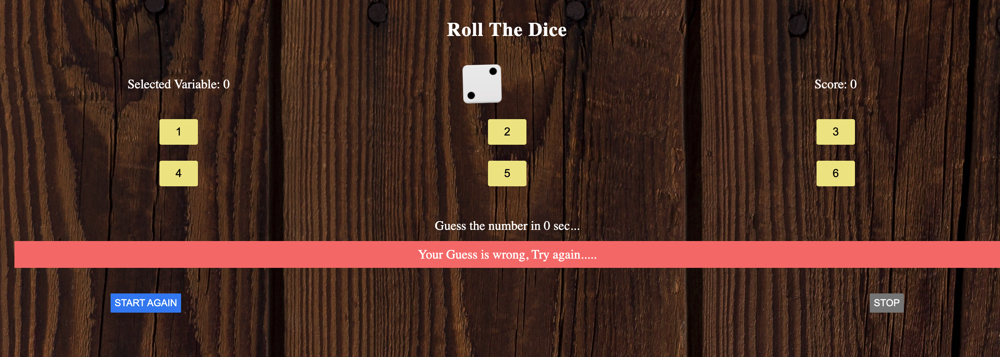

<!-- values -->

<h1 align="center">Roll The Dice Game</h1>

  <h3>
    <a href="https://dice-game-rishabh.netlify.app/">
      Demo
    </a>
  </h3>

<!-- overview -->

<!-- Built with -->

### Built With

- HTML
- CSS
- Javascript

<!-- instruction -->

## How to play

- Step1: When you first launch the game, the game starts after 4 seconds.

- Step2: You have 4 seconds to guess the outcome of the dice before it rolls.

- Step3: After the guess the dice will roll and the guess will be matched with the outcome of the dice roll which is random.

- Step4: If your guess and the dice outcome matches then you guessed it right, if not your guess is wrong.

- Step5: If your guess is right you score 10 points and if not you score 0 points but in both cases the game will start again in 5 seconds.

- Step6: To stop the game you can press the STOP button.

- Step7: After stopping if you want to start the game again press START AGAIN button.
